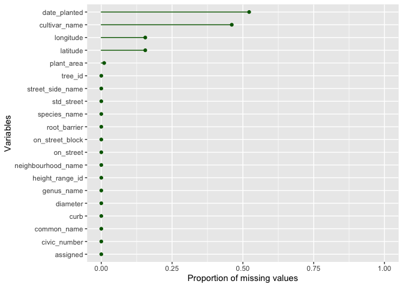
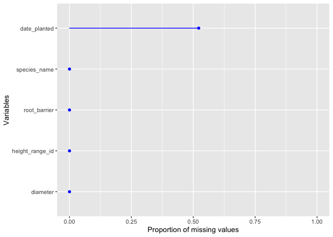
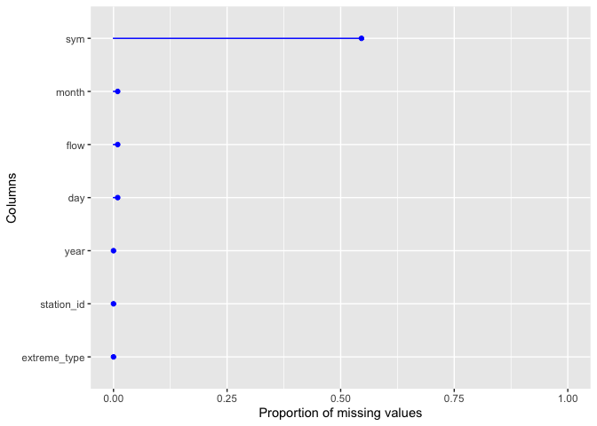

STAT545B Assignment 1
================
Yian Lin
2023-10-31

``` r
library(tidyverse)
```

    ## ── Attaching core tidyverse packages ──────────────────────── tidyverse 2.0.0 ──
    ## ✔ dplyr     1.1.3     ✔ readr     2.1.4
    ## ✔ forcats   1.0.0     ✔ stringr   1.5.0
    ## ✔ ggplot2   3.4.3     ✔ tibble    3.2.1
    ## ✔ lubridate 1.9.3     ✔ tidyr     1.3.0
    ## ✔ purrr     1.0.2     
    ## ── Conflicts ────────────────────────────────────────── tidyverse_conflicts() ──
    ## ✖ dplyr::filter() masks stats::filter()
    ## ✖ dplyr::lag()    masks stats::lag()
    ## ℹ Use the conflicted package (<http://conflicted.r-lib.org/>) to force all conflicts to become errors

``` r
library(datateachr)
library(testthat)
```

    ## 
    ## Attaching package: 'testthat'
    ## 
    ## The following object is masked from 'package:dplyr':
    ## 
    ##     matches
    ## 
    ## The following object is masked from 'package:purrr':
    ## 
    ##     is_null
    ## 
    ## The following objects are masked from 'package:readr':
    ## 
    ##     edition_get, local_edition
    ## 
    ## The following object is masked from 'package:tidyr':
    ## 
    ##     matches

## Exercise 1 & 2: Make a Function and Document it

``` r
#' Visualization of missing values
#'
#' Makes a plot to visualize the proportion of missing values for all or selected columns in a data frame. Please note that this function uses functions in `tidyverse` library. Please make sure that you load that library.
#' 
#' @param df a data frame. I name this parameter as `df` because it is the abbreviation of data frame.
#' @param vars a vector containing selected name(s) of variable(s) in \code{df}. These selected variables will be included in the plot. The default is to show the proportion of missing values for all variables in \code{df}. I name this parameter as `vars` because it is an abbreviation variables.
#' @param point_color the color to be used for the points. The default is "blue". The name of this param basically describe what it is for. 
#' @param line_color the color to be used for the lines. The default is "blue". The name of this param basically describe what it is for. 
#' @param ylab the title of the y axis. Here I use the name `ylab` to follow the ggplot convention.
#' @param xlab the title of the x axis. Here I use the name `xlab` to follow the ggplot convention.
#' 
#' @return a ggplot object visualizing the proportion of missing values for all or selected columns.


plot_missing_values_proportions <- function(df, vars=everything(),
                                            point_color="blue", line_color="blue",
                                            ylab="Variables",
                                            xlab="Proportion of missing values"){
  
  # check if df is a dataframe
  if(!is.data.frame(df)) {
    stop('I am so sorry, but this function only works for data frame input!\n',
         'You have provided an object of class: ', class(df)[1])
  }
  
  # count the number of missing values in all (the default) or selected variables
  count_missing<- df %>%
    summarize(across({{vars}}, ~ sum(is.na(.x))))
  
  # Prepare data for the plot: Pivot count_missing from wide to long
  count_missing <- count_missing %>% 
                    pivot_longer(cols = everything(),
                                 names_to = "Variable",
                                 values_to = "missing_count")
  #print(count_missing)
  
  # Plot it
  ggplot(data = count_missing,
         aes(x = stats::reorder(Variable, missing_count))) +
    geom_bar(aes(y = missing_count/nrow(df)),
             stat = "identity",
             position = "dodge",
             width = 0.001,
             colour = line_color,
             fill = line_color) +
    geom_point(aes(y = missing_count/nrow(df)),
               colour = point_color,
               fill = point_color) +
    ylim(0, 1) +
    coord_flip() +
    labs(y = xlab,x = ylab)
}
```

## Exercise 3: Include examples

In this section, I will demonstrate the usage of my function with a few
examples.

### Example 1

In this example, I use the function `plot_missing_values_proportions()`
to visualize the proportion of missing values for all columns in the
*vancouver_trees* dataset. We can specify the color of the points and
lines in the plot using the `point_color` and `line_color` arguments.

``` r
# for all variables in vancouver_trees
plot_missing_values_proportions(df=vancouver_trees, point_color = 'darkgreen', line_color = 'darkgreen')
```

<!-- -->

### Example 2

We can also choose to visualize the proportion of missing values for
some selected columns in the *vancouver_trees* dataset by specifying
column names using the `vars` argument.

``` r
# for selected variables in vancouver_trees
plot_missing_values_proportions(df=vancouver_trees, 
                                vars = c(species_name, root_barrier,
                                         height_range_id, diameter, date_planted))
```

<!-- -->

### Example 3

Here I visualize the proportion of missing values for all columns in a
dataset named *flow_sample*, and change the title of the y axis to
“Columns”.

``` r
# for selected variables in vancouver_trees
plot_missing_values_proportions(df=flow_sample, ylab = "Columns")
```

<!-- -->

### Example 4

Here I want to show that the function will not work if we input a vector
instead of a data frame through the `df` argument.

``` r
plot_missing_values_proportions(df=c(1,2))
```

    ## Error in plot_missing_values_proportions(df = c(1, 2)): I am so sorry, but this function only works for data frame input!
    ## You have provided an object of class: numeric

## Exercise 4: Test the Function

Here I tested the function for the color used and the existence of a
GeomBar layer.

``` r
# For example 1 given above, test for the color used and the GeomBar layer
example1 <- plot_missing_values_proportions(df=vancouver_trees, point_color = 'darkgreen',
                                            line_color = 'darkgreen')

test_that("example1", {
    expect_true(all(ggplot_build(example1)$data[[2]]$colour == "darkgreen"))
    expect_true("GeomBar" %in% class(example1$layers[[1]]$geom))
})
```

    ## Test passed 🌈

Here I tested the function for the identity of y used in aes() in the
two layers.

``` r
# For example 2 given above, test for the identity of y used in aes() in two layers
example2 <- plot_missing_values_proportions(df=vancouver_trees, 
                                vars = c(species_name, root_barrier,
                                         height_range_id, diameter, date_planted))

test_that("Example2", {
    expect_equal(as.character(rlang::get_expr(example2$layers[[1]]$mapping$y)),
                 as.character(rlang::get_expr(example2$layers[[2]]$mapping$y)))
})
```

    ## Test passed 🥇

Here I tested the function for the title used for the y axis.

``` r
# Test for example 4: change of the ylab
example4 <- plot_missing_values_proportions(df=flow_sample, ylab = "Columns")
test_that("Example4:ylab", {
    expect_true(example4$labels$x == "Columns")
                 
})
```

    ## Test passed 😀

Here I tested the function for returning the right error message when
the input for df is not a dataframe.

``` r
# Test for returning error message when the input for df is not a dataframe
test_that("Non data frame input", {
  expect_error(plot_missing_values_proportions(df=c(4,3,5)), "I am so sorry, but this function only works for data frame input!
You have provided an object of class: numeric")
})
```

    ## Test passed 😸
